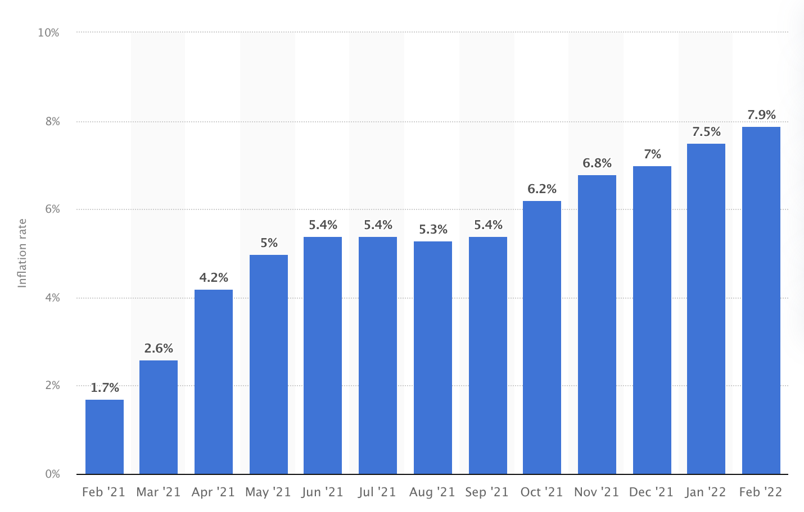
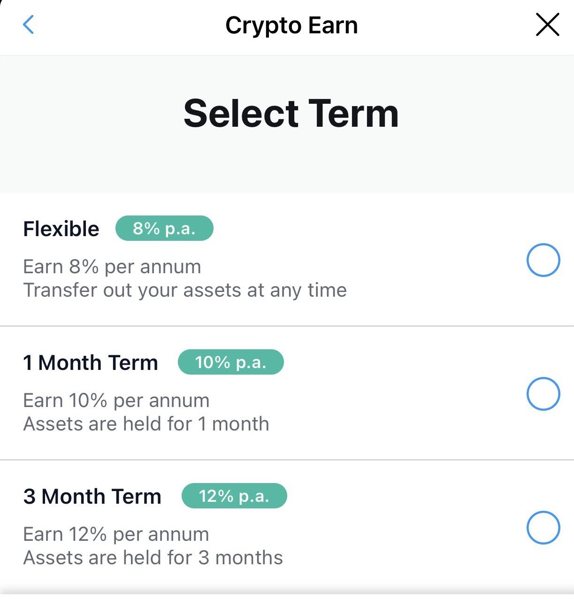

# USD Stable Coins (David) vs Inflation Rate (Goliath)
We aim to promote USD stable coins as a hedge and an alternative investment for non-tech savvy and non-cryptocurrency savvy investors to earn and generate reasonably good returns to counter the current high inflation environment. The inflation monster is a gigantic concern for many common folks. Many cryptocurrency platforms offer attractive interest rates that are higher than the prevailing inflation rates. For example, the current (Feb 2022) inflation rate in the US is around 7.9% p.a. and the return on USD Stable Coin in say CRYPTO.COM is around 12% p.a.

The US Inflation Rate Chart :

(Source : Statista.Com)

The Crypto.Com USD Coin Interest Rate :

(Source : Crypto.Com app - Crypto Earn)

